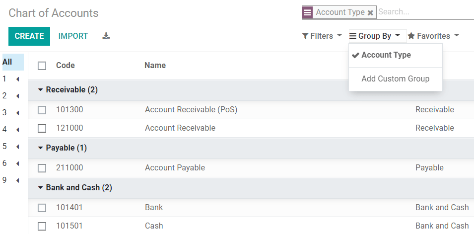
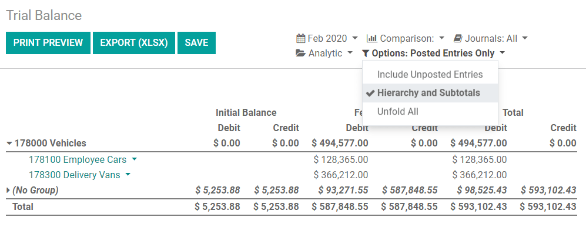

The **Chart of Accounts (COA)** is the list of all the accounts used to record financial transactions in the general ledger of an organization.

The accounts are usually listed in the order of appearance in the financial reports. Most of the time, they are listed as follows :

- Balance Sheet accounts
    - Assets
    - Liabilities
    - Equity

- Profit & Loss
    - Income
    - Expense

When browsing your Chart of Accounts, you can filter the accounts by number, in the left column, and also group them by Account Type.
 

## Configuration of an Account

The country you select at the creation of your database (or additional company on your database) determines which Fiscal Localization Package is installed by default. This package includes a standard Chart of Accounts already configured according to the country’s regulations. You can use it directly or set it according to your company’s needs.

!!! warning "Warning"
    - It is not possible to modify the Fiscal Localization of a company once a Journal Entry has been posted.

To create a new account, go to **Accounting ‣ Configuration ‣ Chart of Accounts**, click on *Create*, and fill out the form.

### Code and Name
Each account is identified by its Code and Name, which also indicates the account’s purpose.

### Type
Configuring correctly the Account Type is critical as it serves multiple purposes:

- Information on the account’s purpose and behavior
- Generate country-specific legal and financial reports
- Set the rules to close a fiscal year
- Generate opening entries

To configure an account type, open the **Type** field’s drop-down selector and select the right type among the following list:

| Method        | Description   | Account Types         |
| --------------|---------------|-----------------------|
| Balance Sheet |    Assets     | Receivables           |
|               |               | Bank and Cash         |
|               |               | Current Assets        |
|               |               | Non Current Assets    |
|               |               | Prepayments           |
|               |               | Fixed Assets          |
| | Liabilities| Payable |
| | | Credit Card |
| | | Current Liabilities |
| | | Non Current Liabilities |
| Profit & Loss | Income | Income |
| | | Other Income |
| | Expense | Expense |
| | | Depreciation |
| | | Cost of Revenue |
|Other| Other| Off-Balance Sheet |

#### Assets, Deferred Expenses, and Deferred Revenues Automation

Some Account Types display a new field **to automate** the creation of ***Assets*** entries, ***Deferred Expenses entries***, and ***Deferred Revenues*** entries.

You have three choices for the Automation field:

1. **1. No** : this is the default value. Nothing happens.
2. **2. Create in draft**: whenever a transaction is posted on the account, a draft entry is created, but not validated. You must first fill out the corresponding form.
3. **3. Create and validate**: you must also select a Model. Whenever a transaction is posted on the account, an entry is created and immediately validated.

### Default Taxes
Select a default tax that will be applied when this account is chosen for a product sale or purchase.

### Tags
Some accounting reports require tags to be set on the relevant accounts. By default, you can choose among the tags that are used by the Cash Flow Statement.

### Account Groups
**Account Groups** are useful to list multiple accounts as sub-accounts of a bigger account and thus consolidate reports such as the **Trial Balance**.

To create a new Account Group, open the account you want to configure as sub-account, click on the Group drop-down selector, select Create and Edit…, fill out the form, and save. Next, set all the sub-accounts with the right Account Group.

To display your **Trial Balance** report with your Account Groups, go to **Accounting ‣ Reporting ‣ Trial Balance**, then open the Options menu and select **Hierarchy and Subtotals**.
 

### Allow Reconciliation
Some accounts, such as accounts made to record the transactions of a payment method, can be used for the reconciliation of journal entries.

For example, an invoice paid with a credit card can be marked as paid if reconciled with the payment. Therefore, the account used to record credit card payments needs to be configured as allowing reconciliation.

To do so, check the Allow Reconciliation box and save.

### Deprecated
It is not possible to delete an account once a transaction has been recorded on it. You can make them unusable by using the Deprecated feature.

To do so, check the Deprecated box and save.

!!! note "See also"
    -  Non-current Assets and Fixed Assets
    -  Deferred Expenses and Prepayments
    -  Deferred Revenues
    -  Fiscal Localization Packages