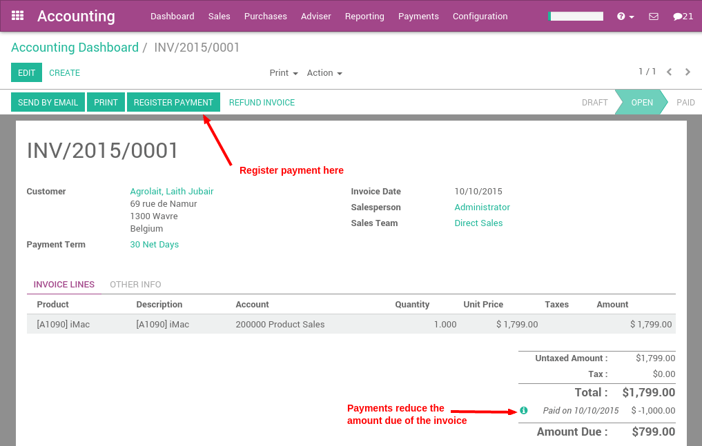
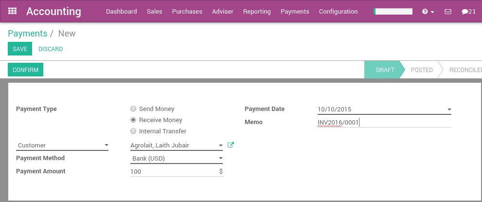
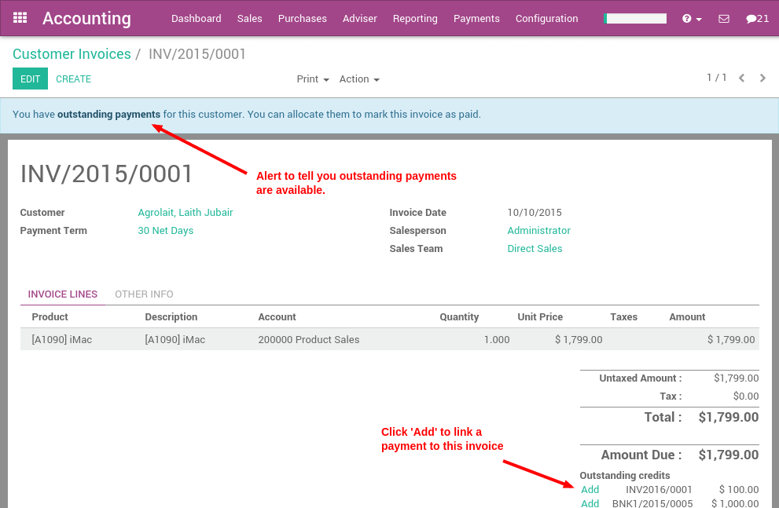
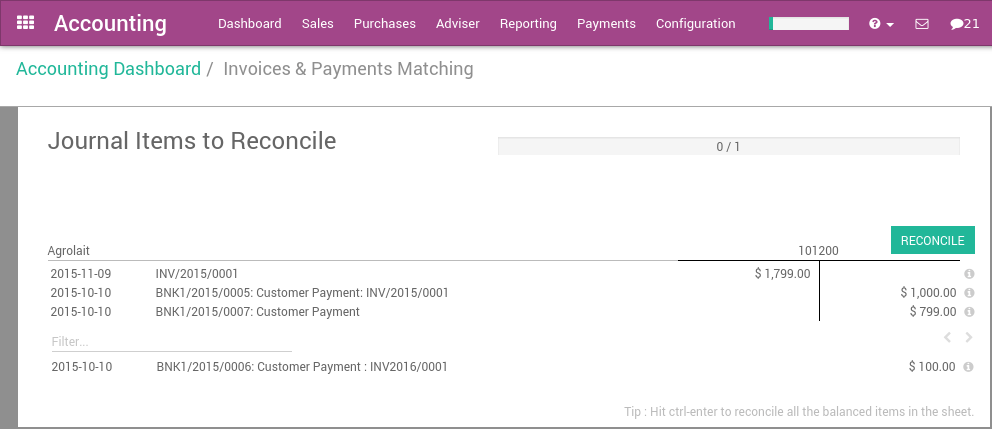
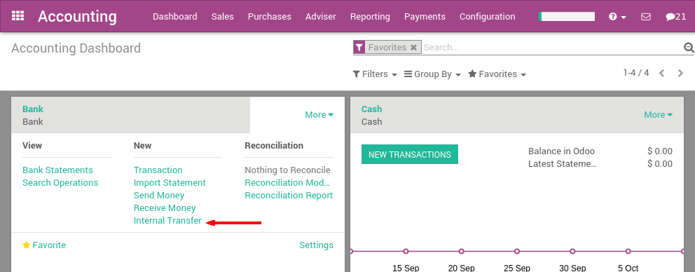
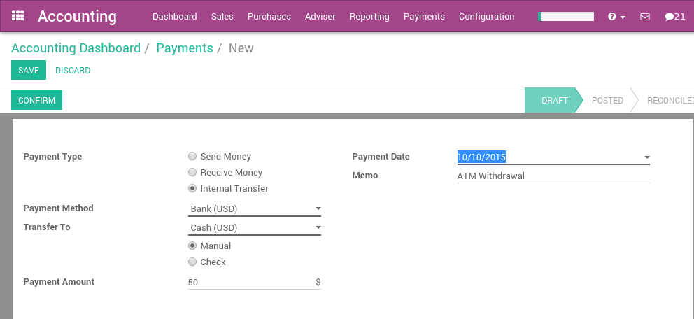

In PerfectWORK, a payment can either be linked directly to an invoice or be a stand alone record for use on a later date:

If a payment is linked to an invoice, it reduces the amount due of the invoice. You can have multiple payments linked to the same invoice.

If a payment is not linked to an invoice, the customer has an outstanding credit with your company, or your company as an outstanding balance with a vendor. You can use this outstanding credit/debit to pay future invoices or bills.

## Paying an invoice
If you register a payment on a customer invoice or a vendor bill, the payment is automatically reconciled with the invoice reducing the amount due.

The green icon near the payment line will display more information about the payment. From there you can choose to open the journal entry or reconcile the payment.

!!! note "Note"
    1. If you unreconcile a payment, it is still registered in your books but not linked to the specific invoice any longer. If you unreconcile a payment in a different currency, PerfectWORK will create a journal entry to reverse the Currency Exchange Loss/Gain posted at the time of reconciliation.

## Payments not tied to an invoice
### Registering a payment
In the Accounting application, you can create a new payment from the Sales menu (register a customer payment) or the Purchases menu (pay a vendor). If you use these menus, the payment is not linked to an invoice, but can easily be reconciled on an invoice later on.

When registering a new payment, you must select a customer or vendor, the payment method, and the amount of the payment. The currency of the transaction is defined by the payment method. If the payment refers to a document (sale order, purchase order or invoice), set the reference of this document in the memo field.

Once confirmed, a journal entry will be posted reflecting the transaction just made in the accounting application.

### Reconciling invoice payments
The easiest way of reconciling a payment with an invoice is to do so on the invoice directly.

When validating a new invoice, Odoo will warn you that an outstanding payment for this customer or vendor is available. In this case, you can reconcile this payment to the invoice near the totals at the bottom, under “Outstanding Payments”.

### Reconciling all your outstanding payments and invoices
If you want to reconcile all outstanding payments and invoices at once (instead of doing so one by one), you can use the batch reconciliation feature within Odoo.

The batch reconciliation feature is available from the dashboard on the Customer Invoices card and the Vendor Bills card for reconciling Accounts Receivable and Payable, respectively.

The payments matching tool will open all unreconciled customers or vendors and will give you the opportunity to process them all one by one, doing the matching of all their payments and invoices at once.

During the reconciliation, if the sum of the debits and credits do not match, it means there is still a remaining balance that either needs to be reconciled at a later date, or needs to be written off directly.

## Transferring money from one bank account to another
Just like making a customer or vendor payment, you transfer cash internally between your bank accounts from the dashboard or from the menus up top.

This will take you to the same screen you have for receiving and making payments.

!!! note "Note"
    1. When making an internal transfer from one bank account to another, select the bank you want to apply the transfer from in the dashboard, and in the register payments screen, you select the transfer to account. Do not go through this process again in the other bank account or else you will end up with two journal entries for the same transaction.