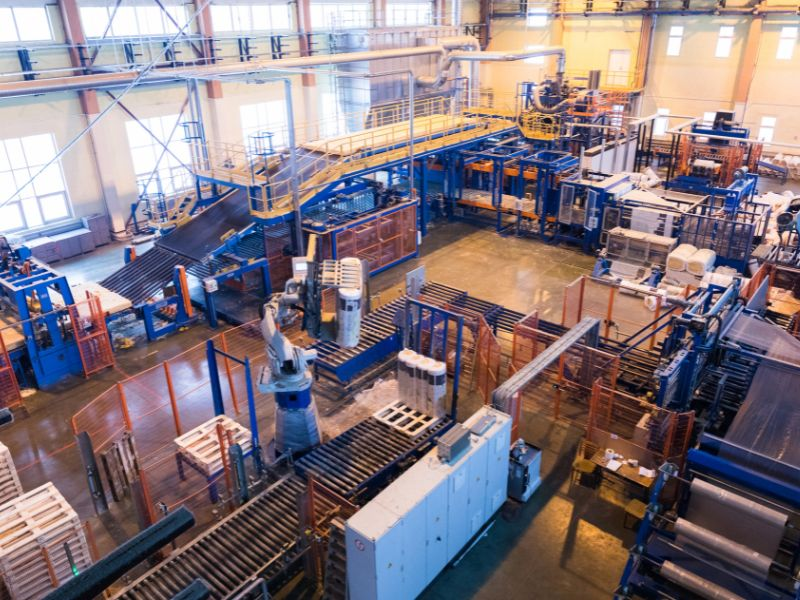

  <h1 class="text-l text-gray-700 font-medium">Applications</h1>

<!-- This example requires Tailwind CSS v2.0+ -->

 

    <a href="01_platform" class="rounded overflow-hidden shadow-lg">
      
      

        
PerfectWORK Platform

      

    </a>
    <a href="20_accounting" class="rounded overflow-hidden shadow-lg">
      
      

        
Accounting & Finance

      

    </a>
    <a href="30_sales_distribution" class="rounded overflow-hidden shadow-lg">
      
      

        
Sales & Distribution

      

    </a>
    <a href="40_crm_marketing" class="rounded overflow-hidden shadow-lg">
      
      

        
CRM & Marketing

      

    </a>
    <a href="50_website" class="rounded overflow-hidden shadow-lg">
      
      

        
Website & eCommerce

      

    </a>
    <a href="60_inventory_manufacturing" class="rounded overflow-hidden shadow-lg">
      
      

        
Inventory & Manufacturing

      

    </a>
    <a href="70_supply_chain" class="rounded overflow-hidden shadow-lg">
      
      

        
Supply Chain & Logistics 

      

    </a>
    <a href="80_human_resources" class="rounded overflow-hidden shadow-lg">
      
      

        
Human Resources

      

    </a>
    <a href="90_customer_services" class="rounded overflow-hidden shadow-lg">
      
      

        
Customer Services

      

    </a>
    <a href="100_retail_store" class="rounded overflow-hidden shadow-lg">
      
      

        
Retail Store

      

    </a>
  

