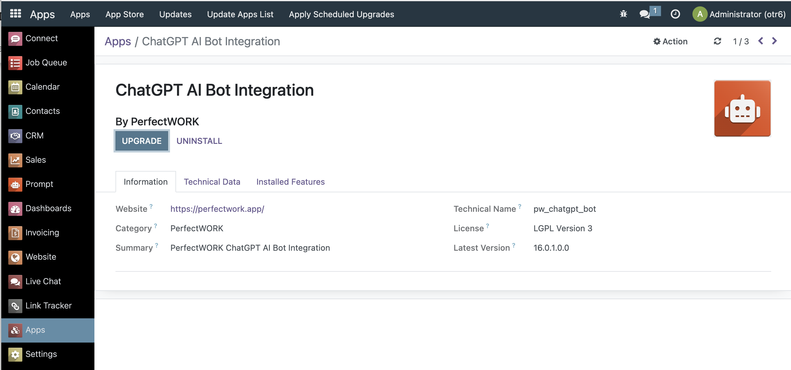
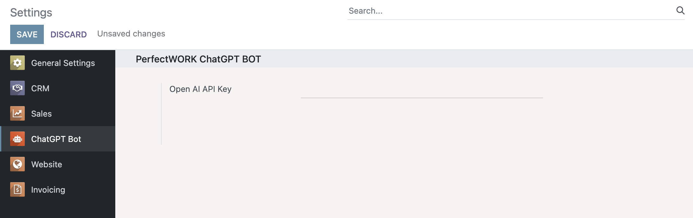

This module allows for seamless integration with the OpenAI ChatGPT API by providing advanced natural language processing capabilities within the PerfectWORK platform. With this module, users can leverage the power of ChatGPT to generate human-like text, perform language translation, and more. It utilizes API calls to communicate with the OpenAI service, making it easy to set up and use.
  
Enable **OdooBot** to have ChatGPT capabilities from the Discuss/Connect application. You can access this via Direct Message with OdooBot in this application.
  

## Installation

You can install, upgrade and uninstall **_`pw_chatgpt_bot`_** modules from the **Apps** dashboard.
  

## Configuration

After installing the **_`pw_chatgpt_bot`_** module, set up the credentials by Navigating  **Settings** -> **ChatGPT Bot** --> **OpenAI API Key** . 
  

  
Next, you will need to give OdooBot this capability by selecting the feature in the Users setting by Navigating  **Settings** -> **Users & Companies** --> **Users** --> _Select the user_ --> Select **OdooBot Status** --> Change it to **ChatGPT**
  

  

## Usage

!!!note
Use the --verbose switch to see what happens behind the scene. Lines are truncated at 79 chars. Use -vv or -vvv to print more.

!!!note
To preserve the history of commands when closing the session, first create an empty file in your home directory: touch ~/.pw_cli_history

More details in the [Tutorial](02_tutorial.md) section.
