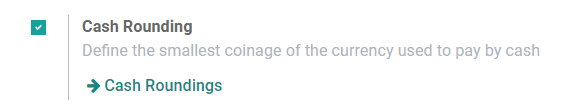

Cash rounding is required when the lowest physical denomination of currency, or the smallest coin, is higher than the minimum unit of account.

For example, some countries require their companies to round up or down the total amount of an invoice to the nearest five cents, when the payment is made in cash.

## Configuration
Go to **Accounting ‣ Configuration ‣ Settings** and enable *Cash Rounding*, then click on *Save*.

Go to **Accounting ‣ Configuration ‣ Cash Roundings**, and click on *Create*.

Define here your Rounding Precision, Rounding Strategy, and Rounding Method.

ANSIS supports two **rounding strategies**:

- **Add a rounding line**: a rounding line is added on the invoice. You have to define which account records the cash roundings.
- **Modify tax amount**: the rounding is applied in the taxes section.

### Apply roundings
When editing a draft invoice, open the Other Info tab, go to the Accounting Information section, and select the appropriate Cash Rounding Method.

## **Process**

To get started, navigate to the **Accounting** app.

  

You will find the option to use Cash Rounding under [CONFIGURATION](https://hibou.io/docs/accounting-3/cash-roundings-1628#) > [SETTINGS](https://hibou.io/docs/accounting-3/cash-roundings-1628#). Then, scroll down to the section labeled **Customer Invoices**, check the box to enable the use of **Cash Rounding,** then [Save](https://hibou.io/docs/accounting-3/cash-roundings-1628#)**.** Once this finishes saving, click on  [Cash Roundings](https://hibou.io/docs/accounting-3/cash-roundings-1628#).

  

Once enabled, Cash Roundings can also be created or configured under [CONFIGURATION](https://hibou.io/docs/accounting-3/cash-roundings-1628#) > [Management](https://hibou.io/docs/accounting-3/cash-roundings-1628#) >[CASH ROUNDINGS](https://hibou.io/docs/accounting-3/cash-roundings-1628#).

Both of these methods will bring you to an overview of any existing Cash Roundings, as well as allowing you to [CREATE](https://hibou.io/docs/accounting-3/cash-roundings-1628#) a new one. 

  

Odoo supports two rounding strategies:

-   **Add a rounding line**: This requires you to set a profit and loss account
    
-   **Modify tax amount**: This will only require you to select a rounding method.
    

### Add a Rounding Line

> **Name:** Give your rounding method a name.

> **Rounding Precision:** Enter a non-zero amount to denote the smallest acceptable coinage.

> **Rounding Strategy:** Select to "Add a rounding line".

> **Profit Account:** Select an account to record profits from the rounding method.

> **Loss Account:** Select an account to record losses from the rounding method.

> **Rounding Method:** Select UP to round up, DOWN to round down, and HALF-UP.   

-   **UP:** Will round up to the next increment using the set rounding precision. If precision is set to .05, and a total ends in .02, rounding up will adjust the total to .05, resulting in a profit of 3 cents.
    
-   **DOWN:** Will round down to the next decrement using the set rounding precision. If precision is set to .05 and a total ends in .02, rounding will adjust the total to .00, resulting in a loss of 2 cents.
    
-   **HALF-UP:** This will round the total up or down to the nearest increment set as the rounding precision. If precision is set to .10, and a total ends in .05 through .09, rounding will adjust the total to .10, but if a total ends in .01 through .04, then it will round down and give .00 as the result.  Your profit/loss would be the difference between the original amount and the result.
    

Click [SAVE](https://hibou.io/docs/accounting-3/cash-roundings-1628/ver/15-0-28#) when ready.  

  

**How it works**: Once you have your Cash Rounding method created, you can add it to a draft invoice on the [OTHER INFO](https://hibou.io/docs/accounting-3/cash-roundings-1628/ver/15-0-28#) tab.

  

When you enter a invoice line, the amount is compared to the rounding rules that are set.  In the following examples, the 'HALF-UP' method applies, so the system adds a line to round up (profit) or down (loss) as required by the applied rounding rule.

  

  

Modify Tax Amount

> Navigate back to the list of Cash Roundings in [CONFIGURATION](https://hibou.io/docs/accounting-3/cash-roundings-1628/ver/15-0-28#) \> [MANAGEMENT](https://hibou.io/docs/accounting-3/cash-roundings-1628/ver/15-0-28#) \>[CASH ROUNDINGS](https://hibou.io/docs/accounting-3/cash-roundings-1628/ver/15-0-28#), then click [Create](https://hibou.io/docs/accounting-3/cash-roundings-1628#).  
> **Name:** Give your rounding method a name.

> **Rounding Precision:** Enter a non-zero amount to denote the smallest acceptable coinage.

> **Rounding Strategy:** Select "Modify tax amount". This will use the set rounding method to add or subtract to the tax amount.

> **Rounding Method:** 
> 
> -   **UP:** Will round up to the next increment using the set rounding precision. If precision is set to .05, and a total ends in .02, rounding up will adjust the total to .05.
>     
> -   **DOWN:** Will round down to the next decrement using the set rounding precision. If precision is set to .05 and a total ends in .02, rounding will adjust the total to .00.
>     
> -   **HALF-UP:** This will round the total up or down to the nearest increment set as the rounding precision. If precision is set to .10, and a total ends in .05 through .09, rounding will adjust the total to .10, but if a total ends in .01 through .04, then it will round down and give .00 as the result.  Your profit/loss would be the difference between the original amount and the result.  
>     
> 
>   
> 
> Click [SAVE](https://hibou.io/docs/accounting-3/cash-roundings-1628#) when ready.

**How it works**: Once you have your Cash Rounding method created, you can add it to a draft invoice on the [OTHER INFO](https://hibou.io/docs/accounting-3/cash-roundings-1628#) tab.

  

When you enter lines with tax amounts, the taxes get adjusted so that the invoice total is rounded according to the rounding rule that is set.  In the two following images, you'll see that the invoice totals are the same, but, due to the rounding rules, more tax is applied to the invoice with the lesser 'Untaxed Amount'.

  

