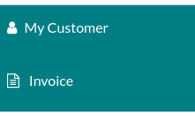
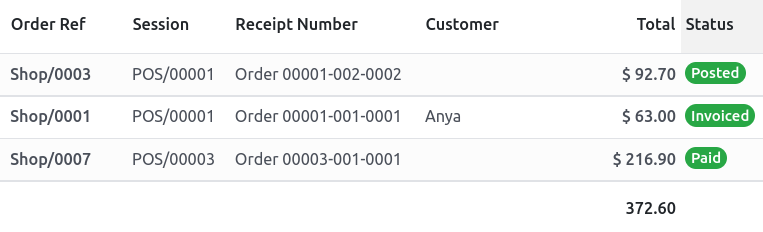
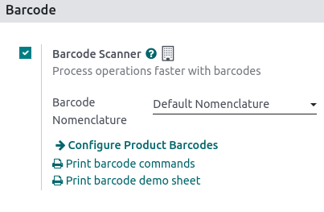

## Invoice issuance
In Point of Sale, you can issue and print invoices upon payment at the cash register or retrieve all the past invoiced orders.

### Set a customer
First, you need to open a session and set your customer. Open the **POS interface** by going to **Point of Sale ‣ New session ‣ Open session**. Then, click **Customer** to access the list of customers.

 
{: .center}

 
From there, you can either set an existing customer by clicking their name or create a new one by clicking **Create**. Doing so opens a customer creation form to fill in with their information. Click Save to validate and set this new customer.

!!!Note

    - You can also edit a customer’s information by clicking Details.
    - If you did not set your customer during the order, you can do so at the payment screen by clicking Customer.

### Invoice a customer
Once an order is done, click Payment to move to the payment screen. Click Invoice underneath the customer’s name to enable issuing and printing invoices upon payment.

 
{: .center}

 
Select the payment method and click **Validate**. The _invoice_ is automatically issued and ready to be downloaded and/or printed.

 
#### Retrieve invoices
To retrieve invoices from the POS dashboard,

 
access all orders made through your POS by going to Point of Sale ‣ Orders ‣ Orders;

 
to access an order’s invoice, open the order form by selecting the order, then click Invoice.
{: .center}

!!!Note

    - Invoiced orders can be identified by the Invoiced status in the Status column.
    - You can filter the list of orders to invoiced orders by clicking Filters and Invoiced.

#### QR codes to generate invoices
Customers can also request an invoice by scanning the QR code printed on their receipt. Upon scanning, they must fill in a form with their billing information and click Get my invoice. On the one hand, doing so generates an invoice available for download. On the other hand, the order status goes from Paid or Posted to Invoiced in the ANSIS backend.

 
{: .center}
 
To use this feature, you have to enable QR codes on receipts by going to **Point of Sale ‣ Configuration ‣ Settings**. Then, select the POS in the **Point of Sale** field, scroll down to the **Bills & Receipts** section and enable _Use QR code on ticket_.

## Barcodes
Using a barcode scanner to process point-of-sale orders improves your efficiency in providing quicker customer service. Barcode scanners can be used both to scan products or to log employees into a POS session.

### Configuration
To use a barcode scanner, you must enable the feature in the Inventory app. Go to I**nventory ‣ Configuration ‣ Settings**, in the Barcode section, tick **Barcode Scanner** and save.

{: .center}

 
Once enabled in Inventory, you can use the barcode feature in Point of Sale with products that have a barcode number assigned.

 

### Assign barcodes

#### To your products
To use this feature in POS, your products must have barcodes assigned. To do so, go to **Point of Sale ‣ Products ‣ Products** and open a _product form_. Add a barcode number in the Barcode field in the General Information tab.

#### To your employees
To add an identification number to an employee, go to the **Employees** app and open an employee form. Choose an identification number for your employee and fill in the _PIN Code_ field in the **HR Settings** tab.

### Use barcodes
#### Scan products
Scan a product’s barcode using a barcode scanner. Doing so adds it directly to the cart. To change the quantity, scan a product as many times as needed, or click Qty and enter the number of products using the keypad.

 
You can also enter the barcode number manually in the search bar to look for the product. Then, click it to add it to the cart.

!!!See also

    Get started

#### Log employees
You can also use a barcode scanner to log your employees. To do so, restrict access to the POS and use barcodes to log your employees in your POS.