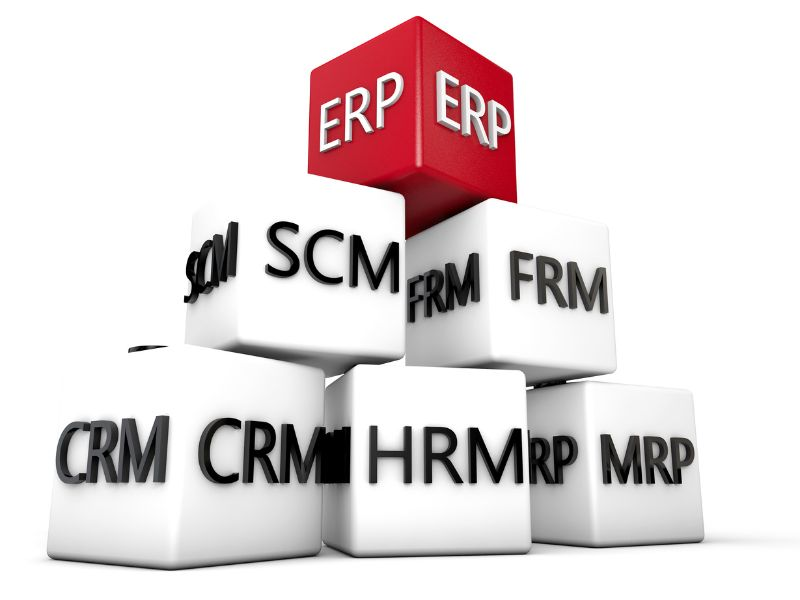

Odoo is a very feature-filled business application framework, with literally hundreds of applications and modules available. When you first access your Odoo instance, the only functionality you will have is a limited messaging options between users. From there, Odoo allows you to purchase and install the applications you need, as you need them. This flexibility makes Odoo much more accessible than many business software solutions.

 

Not long ago, nearly all companies kept their primary information systems in-house. This approach not only requires a lot of capital expense in purchasing servers and software licenses, but also creates a lot of responsibilities and risks in backing up data and ensuring business continuity. Today, more and more companies are choosing to host their business applications in online networks commonly called the cloud. Odoo allows you the flexibility of both options—either hosting on your own hardware, or utilizing Odoo's online software services.

 

The best thing about accessing Odoo Online is that you can jump in and start using the software right away. You don't have to decide what operating system (OS) to use, and you don't have to install any software at all. Just enter the URL into your web browser and you are ready to get started.

 

Another added benefit of taking this approach is that you will verify that your web browser is up to date and compatible with the latest version of Odoo. You can expect to put a great deal of time into determining which Odoo applications / modules are right for your company.
Taking a few hours to use the Odoo Online version is time well spent, and you can put off installing Odoo until you are more certain it is the right software for your business.

<section>
<!-- This example requires Tailwind CSS v2.0+ -->

 

    <a href="01_getting_started/01_overview" class="rounded overflow-hidden shadow-lg">
      
      

        
Getting Started

      

    </a>
    <a href="02_companies_users/01_companies" class="rounded overflow-hidden shadow-lg">
      
      

        
Companies and Users

      

    </a>
    <a href="03_connect/01_overview" class="rounded overflow-hidden shadow-lg">
      
      

        
Communication and Collaboration

      

    </a>
    <a href="01_getting_started/01_overview" class="rounded overflow-hidden shadow-lg">
      
      

        
Calendar & Resource Scheduling

      

    </a>
    <a href="01_getting_started/01_overview" class="rounded overflow-hidden shadow-lg">
      
      

        
Knowledge Management

      

    </a>

</section>

