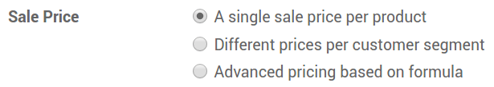
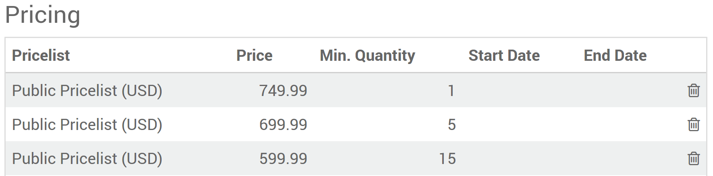
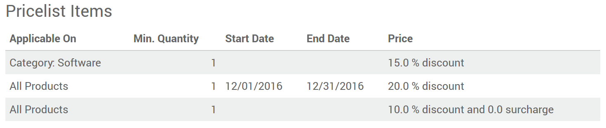
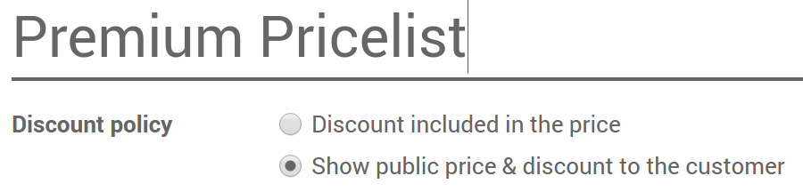

## How to adapt your prices to your customers and apply discounts

ANSIS has a powerful pricelist feature to support a pricing strategy tailored to your business. A pricelist is a list of prices or price rules that ANSIS searches to determine the suggested price. You can set several criteria to use a specific price: periods, min. sold quantity (meet a minimum order quantity and get a price break), etc.
  
As pricelists only suggest prices, they can be overridden by vendors completing sales orders. Choose your pricing strategy from **Sales ‣ Settings**.
  

  
!!!note
    - A single sale price per product : doesn’t let you adapt prices, it use default product price ;
    - Different prices per customer segment : you will set several prices per products ;
    - Advanced pricing based on formula : will let you apply discounts, margins and roundings.

## Several prices per product
To apply several prices per product, select Different prices per customer segment in Sales ‣ Settings. Then open the Sales tab in the product detail form. You can settle following strategies.

### Prices per customer segment
Create pricelists for your customer segments: e.g. registered, premium, etc.
  

### Temporary prices
Apply deals for bank holidays, etc. Enter start and end dates dates.
  

!!!tip
    Make sure you have default prices set in the pricelist outside of the deals period. Otherwise you might have issues once the period over.

### Prices per minimum quantity

!!!note
    The prices order does not matter. The system is smart and applies first prices that match the order date and/or the minimal quantities.

## Discounts, margins, roundings
Advanced pricing based on formula allows to set price change rules. Changes can be relative to the product list/catalog price, the product cost price, or to another pricelist. Changes are calculated via discounts or surcharges and can be forced to fit within floor (minimum margin) and ceilings (maximum margins). Prices can be rounded to the nearest cent/dollar or multiple of either (nearest 5 cents, nearest 10 dollars).
  
Once installed go to **Sales ‣ Configuration ‣ Pricelists (or Website Admin ‣ Catalog ‣ Pricelists** if you use e-Commerce).
  

  
Each pricelist item can be associated to either all products, to a product internal category (set of products) or to a specific product. Like in second option, you can set dates and minimum quantities.

!!!note
    - Once again the system is smart. If a rule is set for a particular item and another one for its category, Odoo will take the rule of the item.
    - Make sure at least one pricelist item covers all your products.
  
There are 3 modes of computation: fix price, discount & formula.
  

  
Here are different price settings made possible thanks to formulas.
  
### Discounts with roundings
e.g. 20% discounts with prices rounded up to 9.99.
  

### Costs with markups (retail)
e.g. sale price = 2*cost (100% markup) with $5 of minimal margin.
  

## Prices per country

Pricelists can be set by countries group. Any new customer recorded in Odoo gets a default pricelist, i.e. the first one in the list matching the country. In case no country is set for the customer, Odoo takes the first pricelist without any country group.
  
The default pricelist can be replaced when creating a sales order.

!!!tip
    You can change the pricelists sequence by drag & drop in list view.

## Compute and show discount percentage to customers

In case of discount, you can show the public price and the computed discount % on printed sales orders and in your eCommerce catalog. To do so:
  
    - Check Allow discounts on sales order lines in **Sales ‣ Configuration ‣ Settings ‣ Quotations & Sales ‣ Discounts**.  
    - Apply the option in the pricelist setup form.
  
