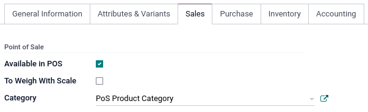
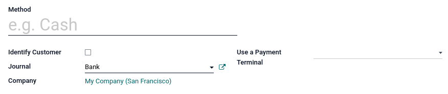
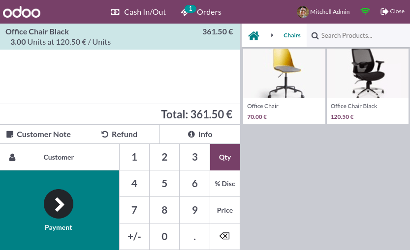
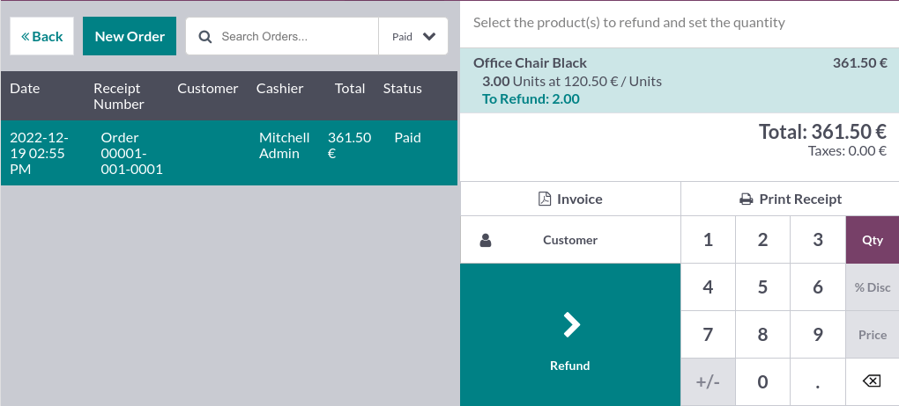
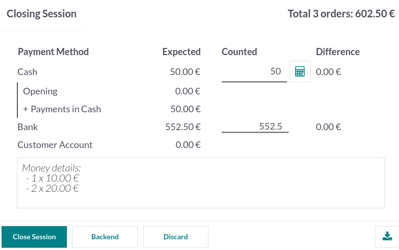
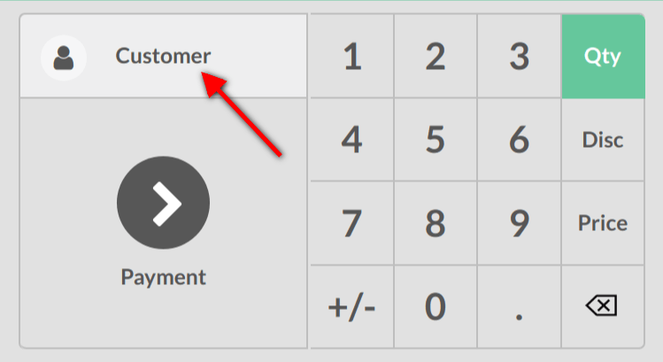
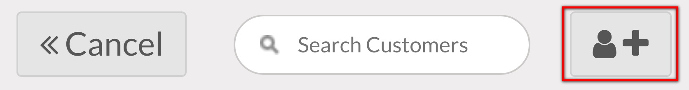
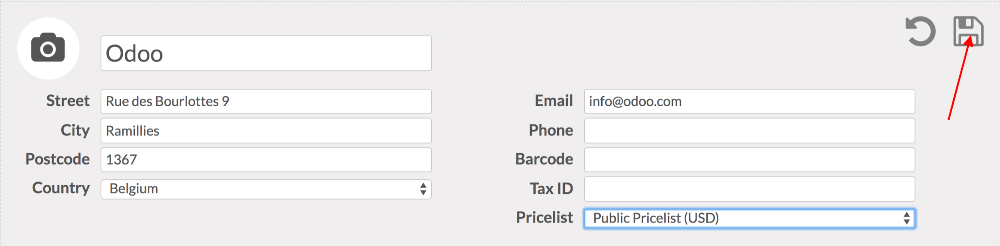

**Point of Sale** is a fully integrated application that allows you to sell products (online or offline) with any device. It also automatically registers product moves in your stock, gives you real-time statistics, and consolidations across all shops.

## Configuration

### Make products available
To make products available for sale, go to **Point of Sale ‣ Products ‣ Products**, and select a product to open the product form. In the Sales tab, enable Available in POS.

 
{: .center}
 

### Configure payment methods
To add a payment method, you first need to create it. Go to **Point of Sale ‣ Configuration ‣ Payment Methods ‣ Create**, and set a name. Check Identify Customer to allow this payment method exclusively for registered customers.

 
Then, select the Journal. Choose Cash to use this payment method for cash payments, or Bank to use it for card payments.

 
{: .center}
 
!!!note
    - Selecting a bank journal automatically adds the Use a Payment Terminal field in which you can add your terminal’s information.

    - Credentials are mandatory to use a payment terminal. To learn how to configure the different terminals, check out the following documentation pages:
        * Adyen configuration
        * Stripe configuration

 

Once the payment method is created, you can select it in your POS settings. To do so, go to **Point of Sale ‣ Configuration ‣ Settings**. Select a POS for which you wish to make the payment method available in the **Point of Sale** field, and add the payment method(s) under the **Payment** section.

## POS sessions
### Start a session
From the **POS dashboard**, click **New Session** and at the **Opening Cash Control** screen, click **Open Session** to start a POS session, or click **Continue Selling** if the session is already opened.

 
!!!Note
    Multiple users can be connected to the same session at the same time. However, the session can only be opened once on the same browser.
 
Click products to add them to the cart. To change the **quantity**, click **Qty** and enter the number of products using the keypad. To add a **discount** or modify the product **price**, click respectively % Disc or Price and enter the amounts.

 
Once an order is completed, proceed to checkout by clicking **Payment**. Select the **payment method**, enter the received amount, and click **Validate**. Click **New Order** to move on to the next customer.

 
{: .center}

 
!!!Tip
    - You can use both , and . on your keyboard as decimal separators.
    - Cash is selected by default if you enter the amount without choosing a payment method.
  
 
### Return and refund products

To return and refund a product

- start a session from the **POS dashboard**  
- click **Refund** and select the corresponding order  
- select the product and the quantity to refund using the keypad  
- click **Refund** to go back to the previous screen  
- once the order is completed, click **Payment** to proceed to the refund  
- click **Validate** and **New Order** to move on to the next customer

 
{: .center}
 
!!!Note

    - You can filter the **orders list** by **Receipt Number**, **Date** or **Customer** using the search bar.
    - You can also refund a product by selecting the returned product from an open session, and setting a negative quantity that equals the number of returned products. To do so, click **Qty** and **+/-**, followed by the quantity of returned products.
 
### Close the POS session
To close your session, click **Close** in the upper right corner of your screen; doing so opens the Closing Control pop-up screen. From this screen, you can retrieve various information:

- the number of orders made and the total amount made during the session;
- the expected amounts grouped by payment method.

Before closing this window, count your cash using the calculator icon. Doing so opens a pop-up window that computes the total amount in the cash drawer depending on the coins and bills counted and added manually. Then, click **Confirm** or **Discard** to close the window. The computed amount is set in the **Counted** column, and the **Money Details** are specified in the **Notes** section.

 
{: .center}

 
Once you are done controlling the amounts, click **Close Session** to close and go back to the **POS dashboard**.

 
!!!Note

    - You can let the session open by clicking Backend or abort and keep selling by clicking Discard.
    - Depending on your setup, you might only be allowed to close a session if the expected cash revenue equals the counted cash. To close it anyway, click Ok at the Payments Difference screen.

!!!Tip

    - It is strongly advised to close your POS session at the end of each day.
    - To look at all your previous sessions, go to Point of Sale ‣ Orders ‣ Sessions.

## View statistics
To access your statistics, go to **Point of Sale ‣ Reporting ‣ Orders**. Or, from the **POS dashboard**, click the vertical ellipsis (⋮) button, **Reporting**, and **Orders**.

 
These statistics are available in a graph or pivot view that you can filter or group depending on your needs.

Registering your customers will give you the ability to grant them various privileges such as discounts, loyalty program, specific communication. It will also be required if they want an invoice and registering them will make any future interaction with them faster.

## Register Customers
### Create a customer
From your session interface, use the customer button.
 
{: .center}
 
Create a new one by using this button.
 

{: .center}

 
You will be invited to fill out the customer form with their information.
 

{: .center}

 
Use the save button when you are done. You can then select that customer in any future transactions.

