The purpose of this document is to provide an overview of how to navigate in Perfectwork 3.0, what the various _Filters_, _Settings_, and _Views_ available within the applications do, and how to use the **Activities** and **Reporting** functions. We'll also include some handy tips and tricks for easily getting around the system and making the most out of your experience with Perfectwork. 

## Application

Once you log in you'll be on Perfectwork's main menu where applications, or Apps, are represented by icons. At first, you may not see very many apps installed. Each app adds new functions to the database and they're installed as needed.

To get started with building out your database, you will need to install the necessary apps for your business needs. To do this, navigate to the **Apps** application by clicking its _icon_.

 

 

!!! info "Global Search"
    Apps aren't listed in alphabetical order, but you can easily navigate to an app by simply typing its name from the main menu. As you type, the installed apps will filter as well as other related items. This is extremely useful when you have multiple apps installed.

     

    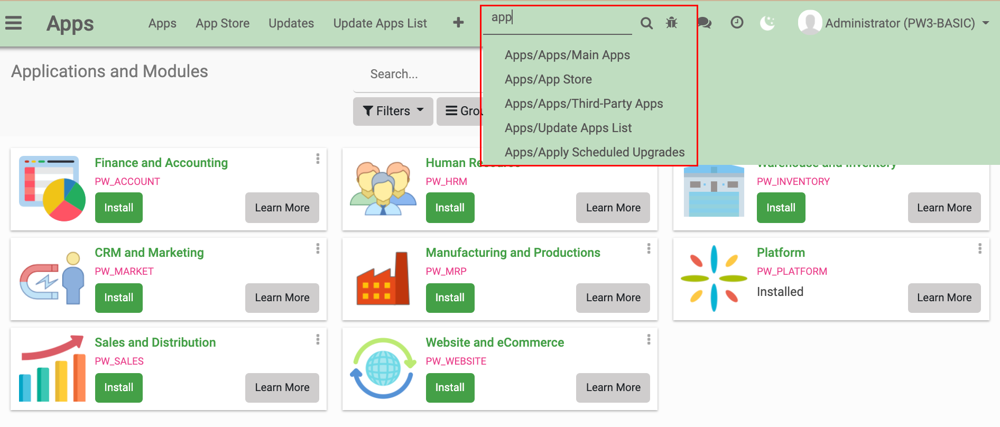

     

Clicking the **Apps** icon will take you to the app repository where you can browse around for the apps that you want to install. 
From this screen, you can see which apps your database has installed already and you can browse through the available apps to install.

If you click on the button on any application, you can see the application's overview page to see if you would like to use it before installing. When you're ready to install an app, simply click the  button and wait for the application to load.

Please Note: For larger apps, this process could take several minutes. 

 

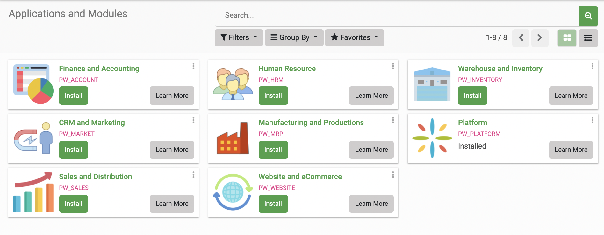

 

Once the app is installed, you will be routed to either the initial setup screen of the application to begin configuring it, or to your database's homepage where you can see your newly installed apps.

## Search

The Search area is persistent in every application in Perfectwork and provides the ability to easily find information.

 

Search is a very straightforward feature and is tailored to the application you're using. _For example, you won't be able to find a Sale Order from the search bar in the CRM app_.

 

By typing in the name of a customer, project, employee, or another object, you can retrieve that to view within the application that you're using. For the purposes of this document, we've highlighted an enhanced search feature in Perfectwork that will make searching even easier. 

 

As you type in the search bar, you will see a dropdown menu appear with different options available to help you quickly locate your desired information. 

 

 

In this example, we've searched the Sales application for _"Peter"_ and are looking for a client "Peter Lim". As you begin typing in the search bar, Perfectwork gives the option to search specific customer within the Sales application for the desired keyword.

 

Any option with the arrow  ‣  icon next to it can be expanded with a click, and Perfectwork will display the available items for the data type that match your keyword. The example above shows the "Customer" section expanded and, as you can see, all customers with the keyword "Peter" in their profile are shown.

 

From here you can either select the specific customer record you want to see, or you can select the option to display all customers with "Peter" in their profile.

## Filters

Filters appear directly beneath the Search bar and allow you to customize the data that is displayed on a given page within any application in Perfectwork. While the filters themselves will vary depending on what application you're using. For this example we will go over the basics of how to use filters in the Sales application. 

 

To get started, navigate to the Sales app. _(If it's not installed, follow the instructions above to install it.)_

 

Once you've launched the Sales application, Select **Orders** ‣ **Customers** let's take a look at the Search area at the top right of the screen. 

 

 

!!! info "Toggle the Filters Menu"

    If you do not see **Filters** or **Group By** or **Favorites** underneath the search bar, click the _spyglass_ icon (with the + sign in it) and they will appear.

    If you want to hide them from view, click the  spyglass icon (with - sign in it) and they will be hidden again. 

Click the  **Filters**  _option_ to review the Filters menu. Let's now go over how to make the most of your Filters. 

 

When you review the Filters that are available within each application, the options will be specific to the data that's housed within that application. The Sales application is displayed for this example, so the options you see in the menu are specific to Sales data. There will typically be a set of default filters that are present in the dropdown menu for you to choose from.

 

If you don't see the data that you want to view in the default filters, you can use the **Add Custom Filter** option to create your own filters. 

 

 

When adding a custom filter, you can set as many conditions as you'd like for the information you need to pull. When you add multiple conditions to the same custom filter, Perfectwork automatically adds the "or" parameter to the search. So, if you want to search for customers who like Chocolate Icing OR Strawberry Icing, you would set the first condition, then click **Add a Condition**

 
<figure markdown> <!-- 
 -->
  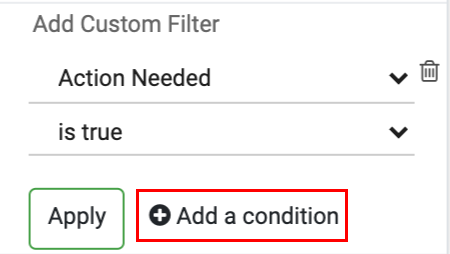{ width="200" loading=lazy }
  <figcaption></figcaption>
</figure>
 

This opens a new section where you'll enter your **"or"** conditions. When you're done, click . 

 
<figure markdown> <!-- 
 -->
  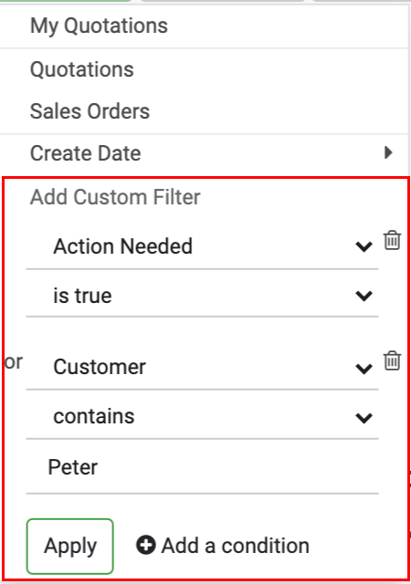{ width="200" loading=lazy }
  <figcaption></figcaption>
</figure>
 

After you select the filters that you want to use, Perfectwork will automatically search the records in the model you’re on for the information you've selected. Your filter will be reflected in the search bar.

 

 

!!! warning "Saving a Custom Filter"
    Custom filters, by default, will be lost once you leave the application that you're using. If you would like to save these custom filters for future use, then you'll need to utilize the **Favorites**  feature, covered below, to accomplish this. 

## Group By

This feature allows you to change how your data is grouped together to better visualize your information and inform your workflows. For example, you may want to see your pipeline data grouped by Salesperson, so you can review which opportunities are being handled by which of your salespeople. This is just one small example of what this feature can do.

 

Like the Filters function discussed above, the ways that Perfectwork will allow you to group your data will depend on the application that you're using and the page that you're on within that application. 

 
<figure markdown> <!-- 
 -->
  { width="300" loading=lazy }
  <figcaption></figcaption>
</figure>
 

Also, like the **Filters** option, you can use the **Add Custom Group** button to create your own groupings if the default options do not suit your needs. Unlike  Filters, custom groupings will only allow you to add one parameter to a Custom Group; however, you may create multiple Custom Groups and apply them together. Perfectwork will add the grouping methods to one another and group the data as you've specified. 

 
<figure markdown> <!-- 
 -->
  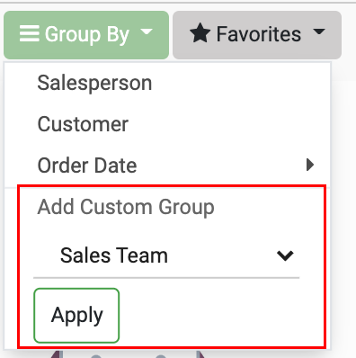{ width="200" loading=lazy }
  <figcaption></figcaption>
</figure>
 

!!! warning "Saving a Custom Group"
    Custom Groups, by default, will be lost once you leave the application that you're using. If you would like to save these custom Groups for use in the future, then you will need to use the   Favorites   feature, covered in the next section, to accomplish this. 

## Favorites

This feature allows you to save custom searches that you've built using the **Filters** and  **Group By** options covered above. Once you have your search or grouping parameters configured and selected, click the  **Favorites**   dropdown menu, then click  Save current search and the following window will appear.  

 

In this window, enter a name for your Search or Custom Group, choose whether or not you want the system to default to this search when you open the application, and if you'd like to share this search with all other users of this application. Once you have made your selections, click **SAVE**.

 
<figure markdown> <!-- 
 -->
  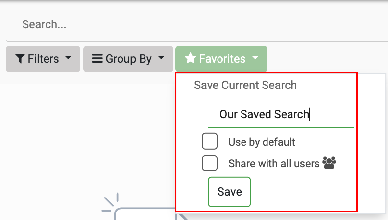{ width="300" loading=lazy }
  <figcaption></figcaption>
</figure>
 

After you've successfully saved your custom Search or Group to your Favorites, simply go to **Favorites**  and select it from the dropdown menu to utilize them in the future.

!!! info "Deleting a Favoutite"
    If you would like to delete any of your Favorites, you simply click the _trash_ can  next to the name of the Favorite you want to delete and then confirm the deletion. 
     
    <figure markdown> <!-- 
    -->
    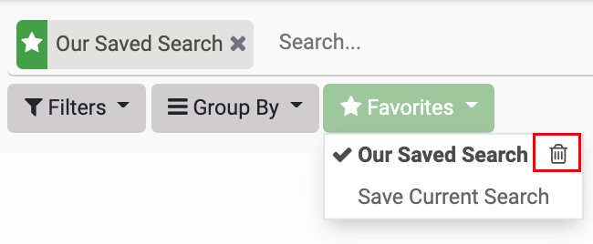{ width="300" loading=lazy }
    <figcaption></figcaption>
    </figure>
     

## Views

This feature is similar to Group By, but instead of changing how the information is grouped on the page, it will change the method by which all of the data is displayed. Think of changing your Group By method like re-arranging information on a pie chart, while changing a View is like moving from a pie chart to a line graph. 

 

Perfectwork has several different Views that you can choose from. Not all of them are available in every application, but we will cover all of them in this document so that when you come across a View you will know what it does. 

 

You can find the different Views that are available within any application tucked under the Search bar at the top right. Each View is denoted by an icon. Available views will vary between Apps.

 

We will be going through each one and will provide examples of how the Views look when selected. For the purposes of this article, we will be using the same data for every view so that you can see the ways that your data can be manipulated simply by changing a View.

 

If you hover over each View's icon, you will see a tool-tip telling you the name of the View. 

 

 
### Kanban

This View will allow you to create a kanban board to view your data. Kanban is an organizational method that typically uses columns and cards to visualize data. As each project, task, or item moves through the kanban sequence from left to right,  you can easily track where each item is in its lifecycle. The example below is from the Sales Pipeline within the CRM application. As you can see from the below screenshot, the Kanban View is selected from the View options and we have our Sales Pipeline organized by stages.

 

 
Each column represents a different stage in the Sales process and you can see the Opportunities under each stage. You can always change the stage that an item is in by dragging and dropping it into the correct column. You can also re-organize the columns by dragging and dropping them to the appropriate placement within the process flow. 

 
To the far right, you also have the option to  Add a Column to create a new Stage of the process flow. Once created, you can drag-and-drop to wherever you'd like within the Kanban view. Once your stages are set up, you can begin assigning items to them.

### List

This View will organize your data into a list format. As you can see below, all of the same information from the Pipeline View is still present in our List view (e.g. Stage, Expected Revenue, Opportunity, and Customer) and some new information has become visible in this view (e.g. Probability and Created On). 

 

 

Some column headers will show an _arrow_ on hover. This indicates that clicking that column header will sort it in either ascending or descending order, and clicking it again will reverse the sort order. Not all fields have this feature.

!!! note "Exposing Columns"

    On the top-right of many different list views in Perfectwork, you'll see the vertical ellipses  icon. Clicking this icon allows you to expose other available columns. Because the data availability will change between apps and views, the options in this fly-out menu will also differ.

     
    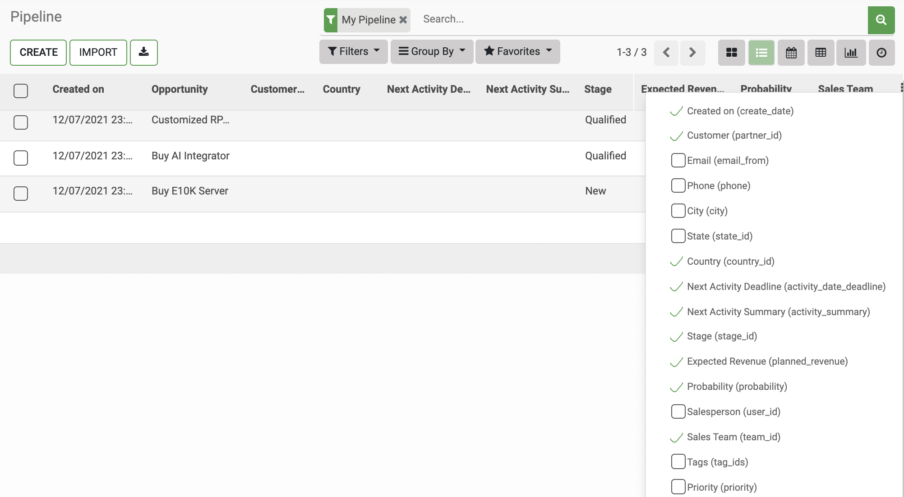

### Calendar

This View allows you to see your Scheduled Activities in a calendar. You can see your upcoming events by the Day, Week, or Month. The calendar will only show items that are created under the Schedule Activity section for each item listed in our Sales Pipeline. 

As you can see from the screenshot below, the Calendar View is selected from the View options and the calendar is displayed by the Month. 

 

 

### Pivot

This View allows you to display your data in a Pivot Table. In the following example, the Pivot View is selected from the View menu. This displays our Sales Pipeline data in this format, showing the Expected Revenue for October at every Stage. Note that our table only displays October because that's when our sample database was created and there is no prior data.

 

 

### Graph

This View allows you to create Graphs and visualize data points in four different ways: 

 

#### Pie Chart

 

#### Bar Chart

 
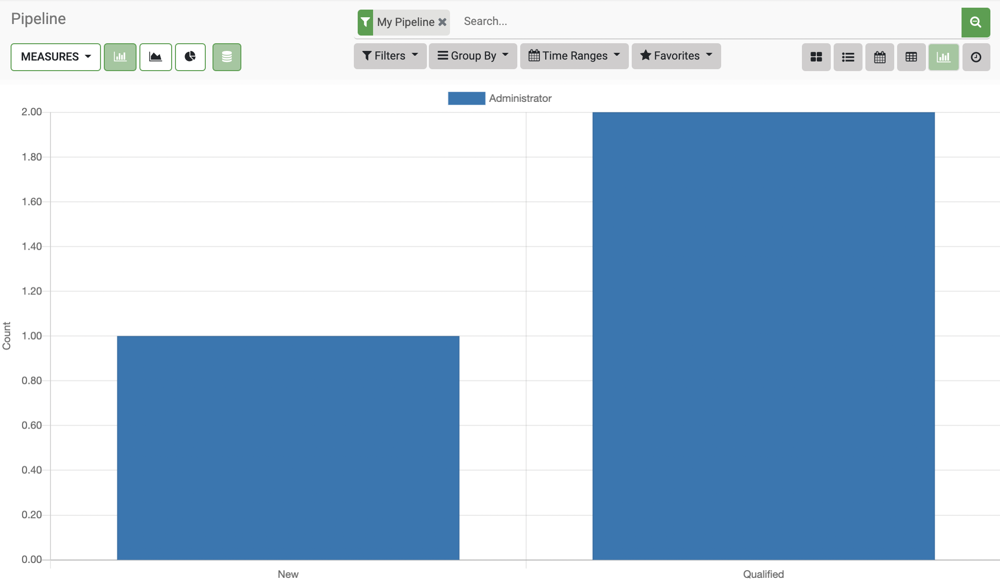

 

#### Line Chart

 
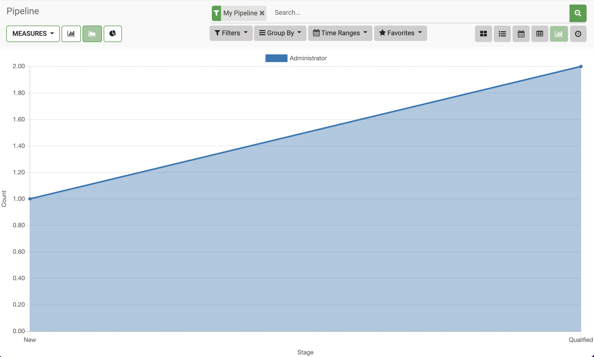

 

To change the input data that gets used to create the different Graphs, click the **MEASURE** button and select the data that you would like to visualize from the dropdown menu.

### Activity

This View allows you to see all of your upcoming Scheduled Activities for your tasks, clients, leads, opportunities, or any other element in your Perfectwork applications. In the example below, we're in the CRM application so these are the scheduled activities in our Sales Pipeline for four different Opportunities. Each Opportunity has its own row and the dates of each scheduled activity shows in a column to the right. Activities in red are overdue, activities in orange are scheduled for today, and activities in green are scheduled for a time in the future. You can schedule additional activities by clicking the **SCHEDULE AN ACTIVITY** button at the bottom of the table. 

 

 

If you click on an Activity in the grid, you'll see what the Activity is, the scheduled date, and you can mark it as Done by clicking the  checkmark icon that's greyed out on the right. You can also schedule additional activities for the row by clicking the  **SCHEDULE AN ACTIVITY** button at the bottom of the pop-up. 

 

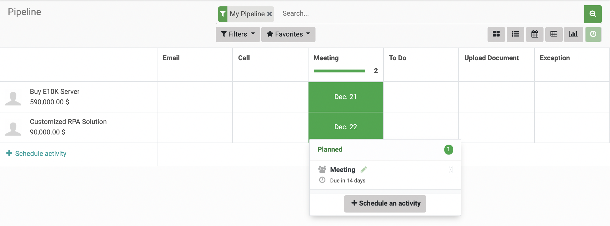

 

## Actions

This feature allows you to take specific actions on an object within Perfectwork applications. This could be anything from setting up access to your system for your users, sending a customer an SMS message, or editing a customer record. To get started, navigate to the Contacts application. If you don't have this application installed, please do so now. 

 

 

When you click the **Action**  menu, you will get a set of pre-determined actions that you can take to modify or interact with that object. These options will vary depending on the application that you're in, and what you are currently viewing or modifying. As you work in Perfectwork, keep an eye out for the **Action**  menu as it can be a great shortcut to what you're trying to do. 
