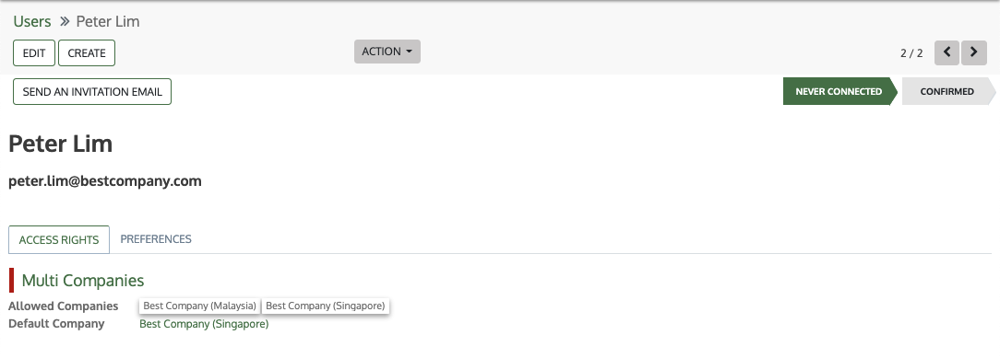

A centralized management environment allows you to select multiple companies simultaneously and set their specific warehouses, customers, equipment, and contacts. It provides you the ability to generate reports of aggregated figures without switching interfaces, which facilitates daily tasks and the overall management process.

## Manage companies and records

Go to **Settings** ‣ **Manage Companies** and fill in the form with your company’s information. If a _Parent Company_ is selected, records are shared between the two companies (as long as both environments are active).

 

 

Switch between or select multiple companies by enabling their selection boxes to activate them. The grayed company is the one which environment is in use. To switch environments, click on the company’s name. In the example below, the user has access to two companies, one is activated, and the environment in use is of Best Company (Singapore).

 

## Employees’ access
Once companies are created, manage your employees’ **Access Rights** for _Multi Companies_.

 

 

If a user has multiple companies activated on his database, and he is editing a record, the editing happens on the record’s related company.

 

Example: if editing a sale order issued under Best Company (Singapore) while working on the Best Company (Malaysia) environment, the changes are applied under Best Company (Singapore) the company from which the sale order was issued).

 

When creating a record, the company taken into account is:

- The current company (the one active) or,
- No company is set (on products and contacts’ forms for example) or,
- The company set is the one linked to the document (the same as if a record is being edited).

